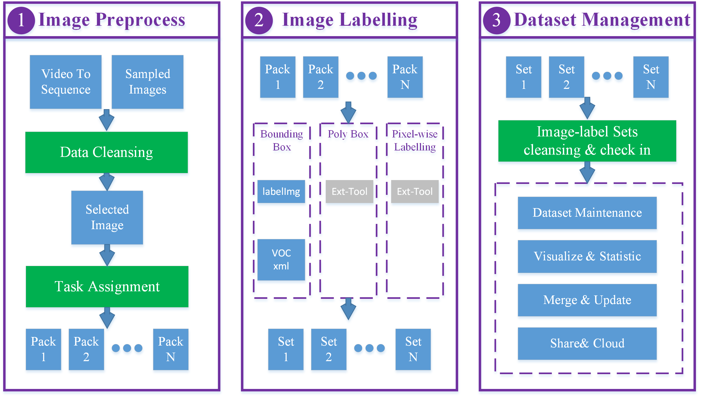

# [](https://github.com/Zhehua-Hu/Enchain)Enchain(under construction)

Enchain is a versatile imag**E** labelli**N**g tool**CHAIN** for deep learning.

It is also a guidance/pipeline to prepare your own dataset.


# [中文维基](https://github.com/Zhehua-Hu/Enchain/wiki/README_Chineses)

## Dataset Generation Procedure



## Installation

* Binary Execuable File
    - [Windows]() (Tested on win7)
    - [Linux]() (Not Support Yet)
* Compile From Source Code
    ```
    # Download
    git clone --recursive https://github.com/Zhehua-Hu/Enchain
    
    # Install Dependency
    ## pyqt5 for python2.x
    sudo apt-get install python-pyqt5
    ## needed tools
    sudo apt-get install pyqt5-dev-tools
    ## UI software
    sudo apt-get install qt4-designer
    

    cd Enchain
    # Build Resources
    make all

    # Run
    python Enchain.py
    ```


## Usage


### Steps


## Development Environment
* Ubuntu 16.04.1 LTS x64
* OpenCV3.1
* Python2.7
* PyQt5.8


# Join us!

## Unsolved Bugs

* Can not open video with Chinese path in windows  
solvered in ubuntu, see "videoSlice.py": `vhandle = cv2.VideoCapture(video_path.encode('utf-8'))`

* left & right widgets name can not be set in Qt designer

* AutoSelectSetting was shown at another thread

## Acknowladgement

Icons: <https://github.com/Templarian/MaterialDesign>

## License

## Related


